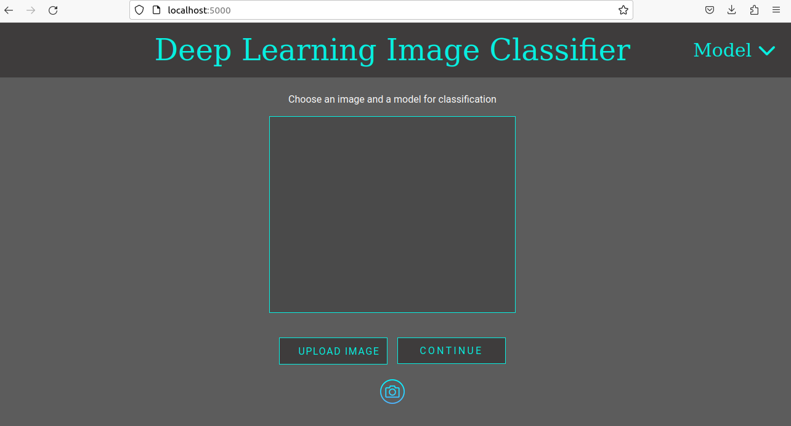
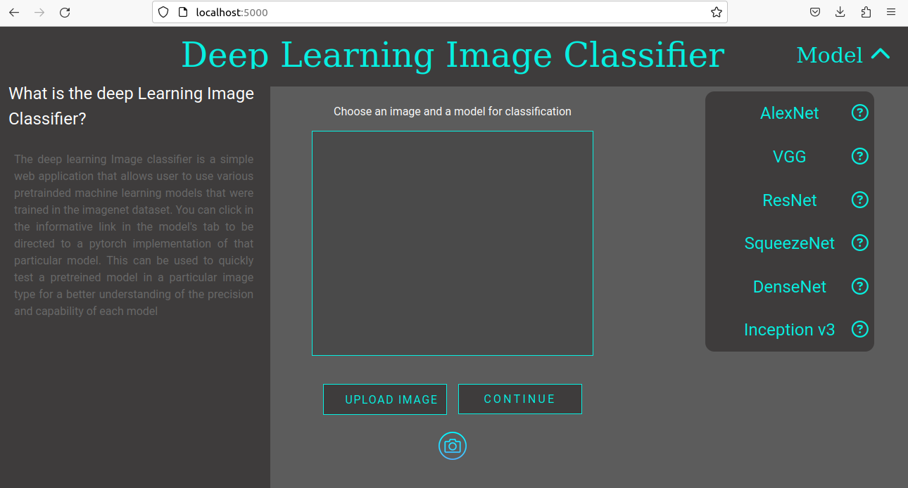
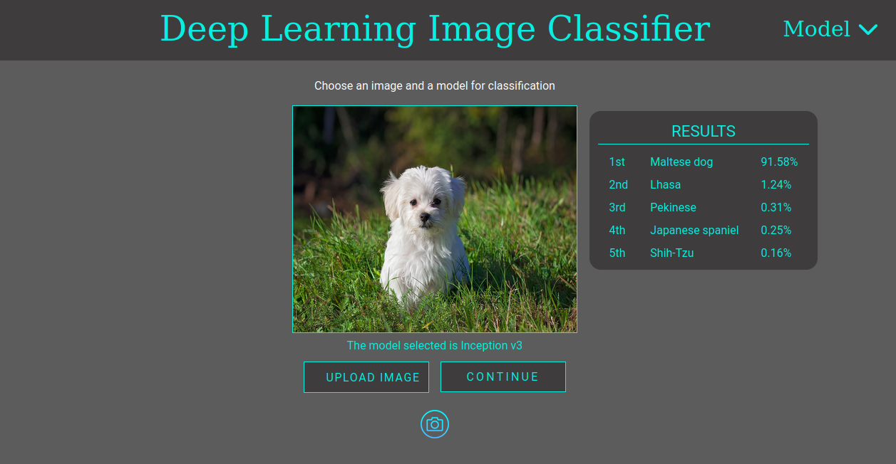

# DL Image classifier

This is a web application built in flask. The backend uses Pythorch's pretrained models to classify images inputted by the user. The user can choose an image (by using the camera or the filesystem) and one of the available models.

Select a model to be used and an image.

get the top 5 predictions

ps: depending on the web browser, the camera capture may not be available.

# Running the application

To run the application. Go to the directory that contains this project. Install the necessary dependencies.

`pip install -r requirements.txt`

execute the server:

`python3 flask_app.py`

Go to http://localhost:5000 and have fun with some AI models.

